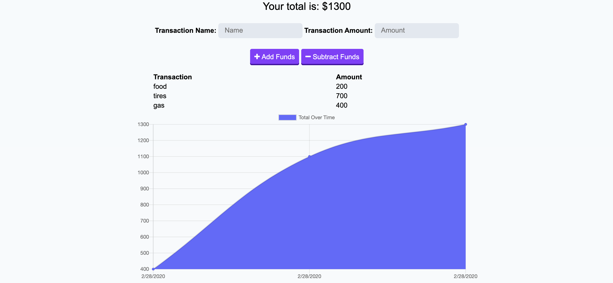

# Progressive-Budget

Budget Tracker, this is a Node.js application that allows you to enter finances into the tracker on and or off line. When the application comes back online the transactions are then added to the previously entered transactions and a new total will appear at the top as well as the graph being upated. This is applicable via service-workers and web-manifest. 

View my deployed application here:

<a href="https://secret-citadel-22710.herokuapp.com/">Heroku Progressive Budget</a>